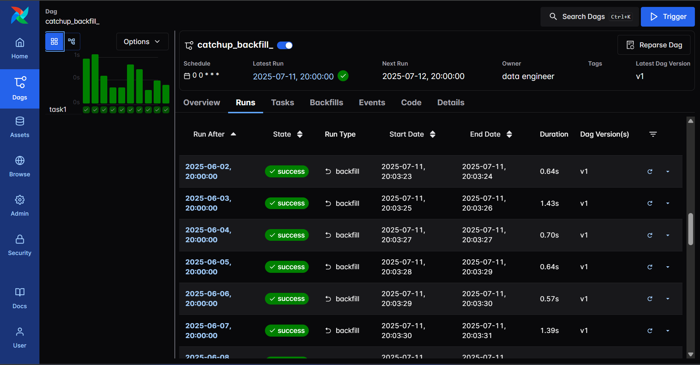

# Airflow - Catchup & Backfill

[back](../../README.md)

- [Airflow - Catchup \& Backfill](#airflow---catchup--backfill)
  - [Catchup](#catchup)
  - [Backfill](#backfill)

---

## Catchup

- `Catchup`

  - If you set `catchup=True` in the DAG, the scheduler will **kick off a DAG Run** for any data interval that has **not been run since the last data interval** (or has been cleared).

- define a workflow start from a past

```py
from datetime import datetime, timedelta
from airflow.sdk import DAG, task
from airflow.operators.python import PythonOperator
from airflow.operators.bash import BashOperator

default_args = {
    'owner': 'data engineer',
    'retries': 5,
    'retry_delay': timedelta(minutes=5),
    'schedule_interval': '@daily',
}

with DAG(
    default_args=default_args,
    dag_id='catchup_backfill',
    description='DAG with single value xcom',
    start_date=datetime(2020, 1, 1),        # start from a past
    schedule='@daily',
    catchup=True
) as dag:
    task1 = BashOperator(
        task_id='task1',
        bash_command="echo hello world",
    )

```

- When trigger can manage how to catch up all un-run DAG




---

## Backfill

- `Backfill`:
  - run the DAG for a specified historical period

```sh
airflow backfill create --dag-id DAG_ID \
    --start-date START_DATE \
    --end-date END_DATE \

# docker command
docker exec -it docker-airflow-scheduler-1 bash airflow backfill create --dag-id backfill --from-date 2025-5-1 --to-date 2025-5-4
```


