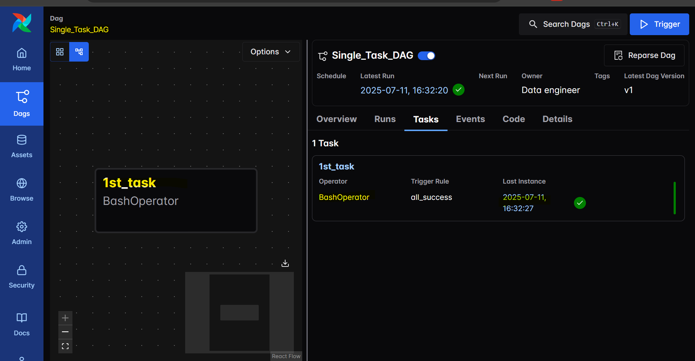
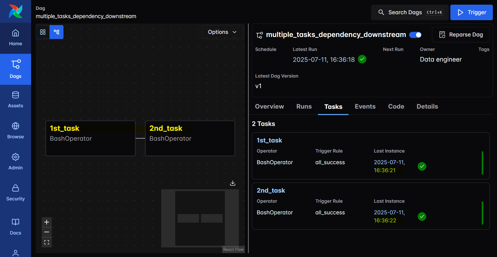
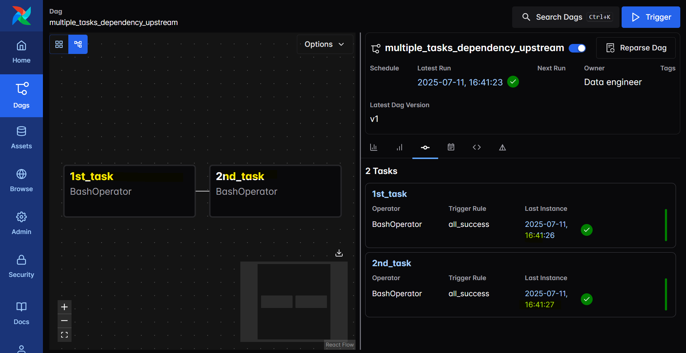
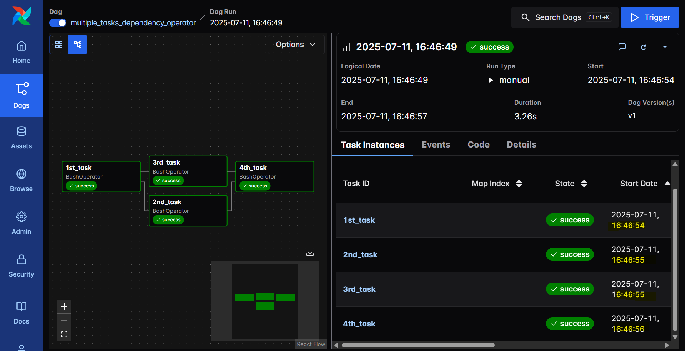

# Airflow - DAG: Bash Operator

[Back](../../../README.md)

- [Airflow - DAG: Bash Operator](#airflow---dag-bash-operator)
  - [Disable example DAGs](#disable-example-dags)
  - [Bash Operator](#bash-operator)
    - [Single Task](#single-task)
    - [Multiple Tasks with dependency](#multiple-tasks-with-dependency)
      - [Using downstream method](#using-downstream-method)
      - [Using upstream method](#using-upstream-method)
      - [Using operators `>>`](#using-operators-)

## Disable example DAGs

```yml
AIRFLOW__CORE__LOAD_EXAMPLES: "false"
```

```sh
# down with volumd
docker compose down -v

docker compose up airflow-init
docker compose up -d
```

---

## Bash Operator

### Single Task

- `dags/single_task.py`

```py
from datetime import datetime, timedelta
from airflow import DAG
from airflow.operators.bash import BashOperator

default_args = {
    "owner": "Data engineer",
    "retries": "5",
    "retry_delay": timedelta(minutes=2),
    "schedule_interval": '@daily',
}

with DAG(
    dag_id="Single_Task_DAG",
    description="A DAG has a single task.",
    start_date=datetime(2025, 7, 10),
    default_args=default_args,
) as dag:
    task1 = BashOperator(
        task_id="1st_task",
        bash_command="echo this the 1st task."
    )

```



---

### Multiple Tasks with dependency

#### Using downstream method

```py
from datetime import datetime, timedelta
from airflow import DAG
from airflow.operators.bash import BashOperator

default_args = {
    "owner": "Data engineer",
    "retries": "5",
    "retry_delay": timedelta(minutes=2),
    "schedule_interval": '@daily',
}

with DAG(
    dag_id="multiple_tasks_dependency_downstream",
    description="A DAG has multiple tasks using downstream method.",
    start_date=datetime(2025, 7, 10),
    default_args=default_args,
) as dag:
    task1 = BashOperator(
        task_id="1st_task",
        bash_command="echo this the 1st task."
    )

    task2 = BashOperator(
        task_id="2nd_task",
        bash_command="echo this the 2nd task."
    )

    task1.set_downstream(task2)
```



---

#### Using upstream method

```py
from datetime import datetime, timedelta
from airflow import DAG
from airflow.operators.bash import BashOperator

default_args = {
    "owner": "Data engineer",
    "retries": "5",
    "retry_delay": timedelta(minutes=2),
    "schedule_interval": '@daily',
}

with DAG(
    dag_id="multiple_tasks_dependency_upstream",
    description="A DAG has multiple tasks using upstream method.",
    start_date=datetime(2025, 7, 10),
    default_args=default_args,
) as dag:
    task1 = BashOperator(
        task_id="1st_task",
        bash_command="echo this the 1st task."
    )

    task2 = BashOperator(
        task_id="2nd_task",
        bash_command="echo this the 2nd task."
    )

    task2.set_upstream(task1)
```



---

#### Using operators `>>`

```py
from datetime import datetime, timedelta
from airflow import DAG
from airflow.operators.bash import BashOperator

default_args = {
    "owner": "Data engineer",
    "retries": "5",
    "retry_delay": timedelta(minutes=2),
    "schedule_interval": '@daily',
}

with DAG(
    dag_id="multiple_tasks_dependency_operator",
    description="A DAG has multiple tasks using operator method.",
    start_date=datetime(2025, 7, 10),
    default_args=default_args,
) as dag:
    task1 = BashOperator(
        task_id="1st_task",
        bash_command="echo this the 1st task."
    )

    task2 = BashOperator(
        task_id="2nd_task",
        bash_command="echo this the 2nd task."
    )

    task3 = BashOperator(
        task_id="3rd_task",
        bash_command="echo this the 3rd task."
    )

    task4 = BashOperator(
        task_id="4th_task",
        bash_command="echo this the 4th task."
    )

    task1 >> [task2, task3]

    task4 << [task2, task3]

```


