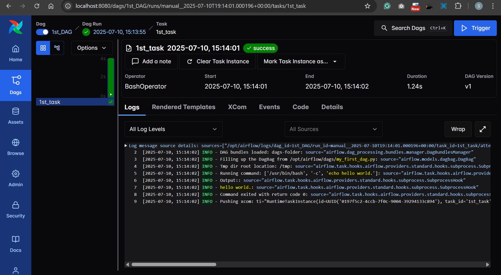

## Disable example DAGs

```yml
AIRFLOW__CORE__LOAD_EXAMPLES: "false"
```

```sh
# down with volumd
docker compose down -v

docker compose up airflow-init
docker compose up -d
```

---

## 1st DAG

- `dags/my_first_dag.py`

```py
from datetime import datetime, timedelta
from airflow import DAG
from airflow.operators.bash import BashOperator

default_args = {
    "owner": "Data engineer",
    "retries": "5",
    "retry_delay": timedelta(minutes=2),
    'schedule_interval': '@daily',
}

with DAG(
    dag_id="1st_DAG",
    description="This is my 1 dag",
    start_date=datetime(2025, 7, 10, 16),
    default_args=default_args,
) as dag:
    task1 = BashOperator(
        task_id="1st_task",
        bash_command="echo hello world."
    )

```


