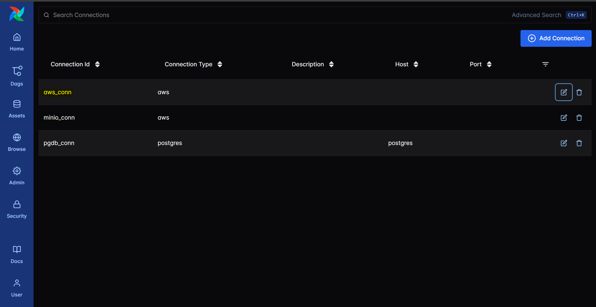
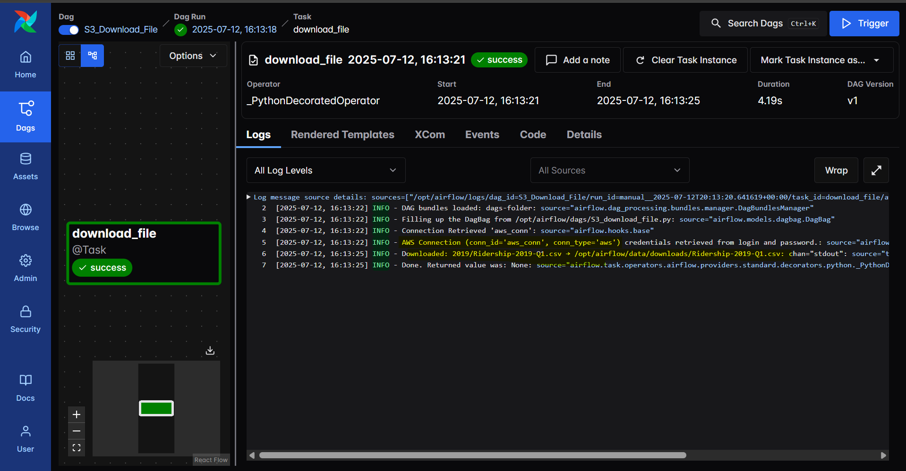

# Airflow - Download csv file from S3

[Back](../../README.md)

---

## Configure S3

- create S3 bucket
- Upload csv file

---

## Create AWS Connection in Airflow



---

## Create DAG

```py
from airflow.decorators import dag, task
from airflow.providers.amazon.aws.hooks.s3 import S3Hook
from datetime import datetime
import os

BUCKET_NAME = "simonangelfong-airflow"
BUCKET_KEY = "2019/Ridership-2019-Q1.csv"
LOCAL_DIR = "/opt/airflow/data/downloads"


@dag(
    dag_id="S3_Download_File",
    start_date=datetime(2024, 1, 1)
    schedule=None,
    catchup=False,
    tags=["S3", "AWS"]
)
def download_s3_files():

    @task
    def download_file(bucket_name: str, key: str, local_dir: str):
        # create hook
        hook = S3Hook(aws_conn_id="aws_conn")
        # create dir
        os.makedirs(local_dir, exist_ok=True)
        local_path = os.path.join(local_dir, os.path.basename(key))
        hook.get_key(key=key, bucket_name=bucket_name).download_file(
            local_path)
        print(f"Downloaded: {key} → {local_path}")

    download_file(bucket_name=BUCKET_NAME, key=BUCKET_KEY, local_dir=LOCAL_DIR)

dag = download_s3_files()
```

---

- Execute


