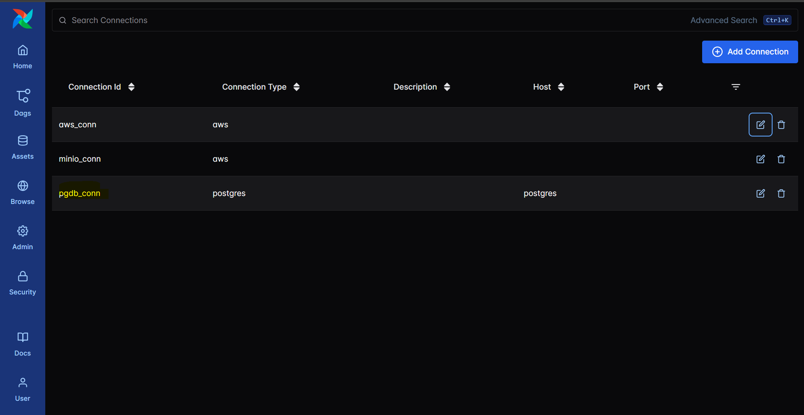
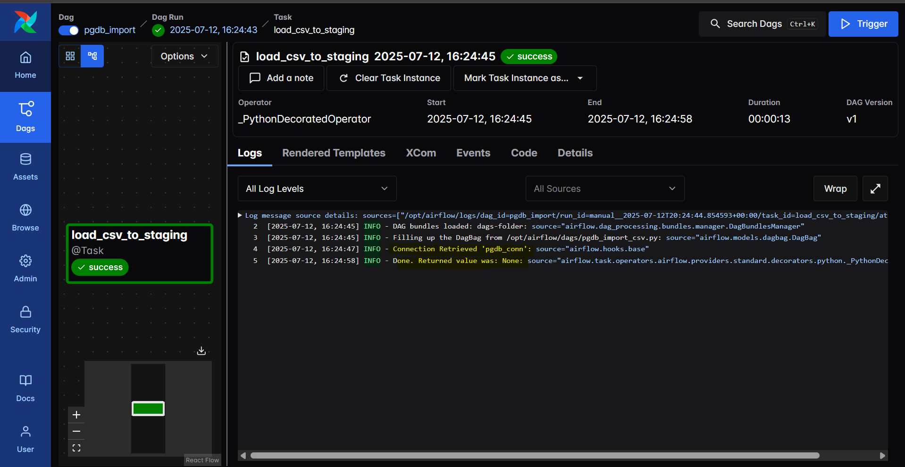
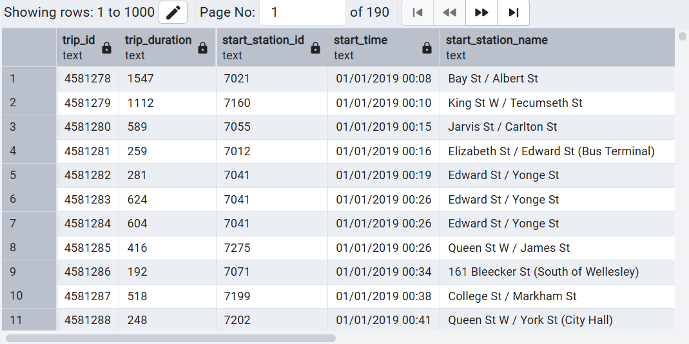

# Airflow - Import CSV into PostgresSQL

[Back](../../README.md)

---

## Create Database and table in PostgreSQL

```sql
CREATE DATABASE project;
\c project;

-- Create the staging table
CREATE TABLE staging_tb (
    trip_id             TEXT,
    trip_duration       TEXT,
    start_station_id    TEXT,
    start_time          TEXT,
    start_station_name  TEXT,
    end_station_id      TEXT,
    end_time            TEXT,
    end_station_name    TEXT,
    bike_id             TEXT,
    user_type           TEXT
);
```

---

## Create PostgresSQL connection in Airflow



---

## Define DAG

```py
import os
from datetime import datetime
import pandas as pd
from airflow.decorators import dag, task
from airflow.providers.postgres.hooks.postgres import PostgresHook

@dag(
    dag_id="pgdb_import",
    start_date=datetime(2024, 1, 1),
    schedule=None,
    catchup=False,
    tags=["postgres", "csv"]
)
def import_csv():

    @task
    def load_csv_to_staging():
        file_path = "/opt/airflow/data/downloads/Ridership-2019-Q1.csv"

        # check if exist
        if not os.path.exists(file_path):
            raise FileNotFoundError(f"{file_path} not found.")

        df = pd.read_csv(file_path, dtype=str)  # Load all as str to avoid parse errors

        # Clean column name
        df.columns = [col.strip().lower().replace(" ", "_") for col in df.columns]

        # Connect PGDB
        hook = PostgresHook(postgres_conn_id="pgdb_conn")
        engine = hook.get_sqlalchemy_engine()

        # Load into the staging table
        df.to_sql("staging_tb", engine, if_exists="append", index=False)

    load_csv_to_staging()

dag = import_csv()
```



- Confirm

```sh
SELECT *
FROM staging_tb;
```


