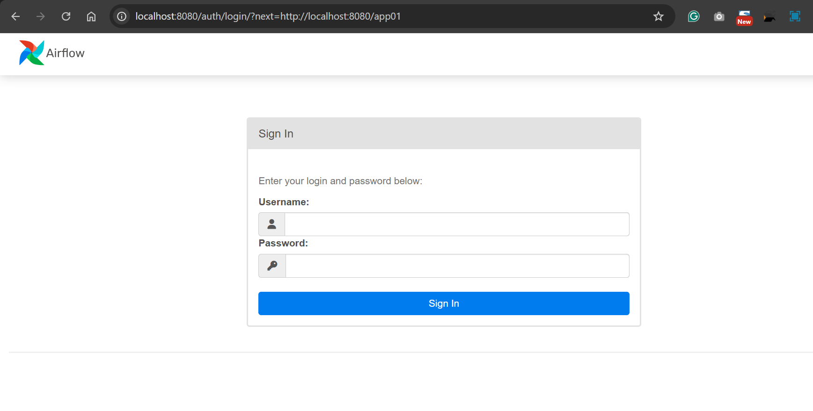

# Airflow - Installation

- [Back](../../README.md)

---

- Ref:https://airflow.apache.org/docs/apache-airflow/stable/howto/docker-compose/index.html

## Install with Docker

```sh
# fetch docker-compose.yaml.
curl -LfO 'https://airflow.apache.org/docs/apache-airflow/3.0.2/docker-compose.yaml'
```

- remove the redis and celery in compose yaml file.

```sh
#  run database migrations and create the first user account.
docker compose up airflow-init
# run until:
#  airflow-init-1 exited with code 0

# start all services:
docker compose up -d

docker ps
```

- Visit:
  - localhost:8080


