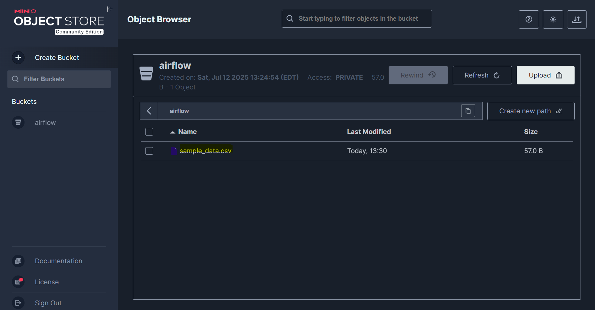

# Airflow - Sensor

[Back](../../README.md)

- [Airflow - Sensor](#airflow---sensor)
  - [Sensor](#sensor)
  - [MINIO](#minio)

---

## Sensor

- `Sensors`
  - a special type of **Operator** that are designed to **wait for something to occur**.
  - It can be
    - time-based
    - waiting for a file or an external event.
- two different modes
  - `poke` (default): The Sensor takes up a worker slot for its **entire runtime**
  - `reschedule`: The Sensor takes up a worker slot **only when it is checking**, and **sleeps** for a set duration between checks

---

## MINIO

- ref: https://min.io/docs/minio/container/index.html

```sh
docker run \
    -d  \
    -p 9000:9000 \
    -p 9001:9001 \
    --name minio1 \
    -v ./minio/data:/data \
    -e "MINIO_ROOT_USER=ROOTUSER" \
    -e "MINIO_ROOT_PASSWORD=CHANGEME123" \
    quay.io/minio/minio server /data --console-address ":9001"
```

- Login localhost:9001
  - using the user and pwd


---

- Create bucket


- Create a simple csv file `sample_data/sample_data/csv`



- Drag csv file to the bucket

- Create DAG

- get amazon package version

```sh
docker exec -it docker-compose-airflow-scheduler-1 bash
pip list | grep amazon
# apache-airflow-providers-amazon           9.8.0
```

- Go official docuemnt for correct version
  - https://airflow.apache.org/docs/apache-airflow-providers-amazon/9.8.0/index.html
  - https://airflow.apache.org/docs/apache-airflow/stable/core-concepts/objectstorage.html


- Create S3 connection:
  - 