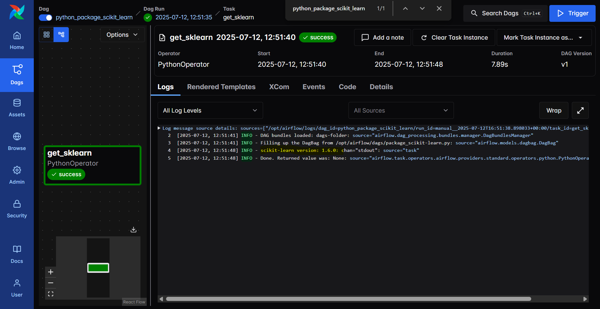

# Airflow - Install Python Package in Docker

[Back](../../README.md)

- [Airflow - Install Python Package in Docker](#airflow---install-python-package-in-docker)
  - [Install Packages](#install-packages)
  - [Dockerfile](#dockerfile)

---

## Install Packages

- Image Extending
- Image Customising

---

## Dockerfile

- Create a requirements.txt file to define packages to install

```txt
scikit-learn==1.7.0
```

- Create `Dockerfile`

```dockerfile
FROM apache/airflow:slim-3.0.3rc6-python3.11
COPY requirements.txt /
RUN pip install --upgrade pip
RUN pip install --no-cache-dir "apache-airflow==${AIRFLOW_VERSION}" -r /requirements.txt
```

- Build image

```sh
docker build . --tag airflow-scikit-learn:latest
```

- Update Docker compose image

```yaml
# image: ${AIRFLOW_IMAGE_NAME:-apache/airflow:3.0.2}
build: .
```

- Create a DAG to verify the package has been installed

```py
from datetime import datetime, timedelta
from airflow import DAG, task
from airflow.operators.python import PythonOperator

default_args = {
    'owner': 'data engineer',
    'retries': 5,
    'retry_delay': timedelta(minutes=5),
    'schedule_interval': '@daily',
}


def get_sklearn():
    import sklearn
    print(f"scikit-learn version: {sklearn.__version__}")


with DAG(
    default_args=default_args,
    dag_id='python_package_scikit_learn',
    description='DAG to verify the installed package',
    start_date=None
) as dag:
    get_sklearn = PythonOperator(
        task_id="get_sklearn",
        python_callable=get_sklearn
    )

    get_sklearn
```


