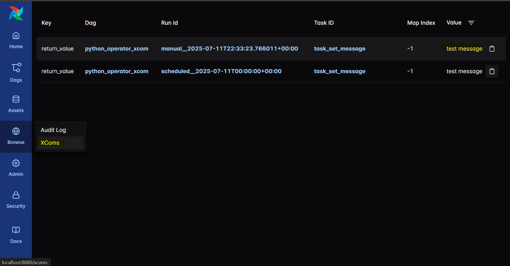
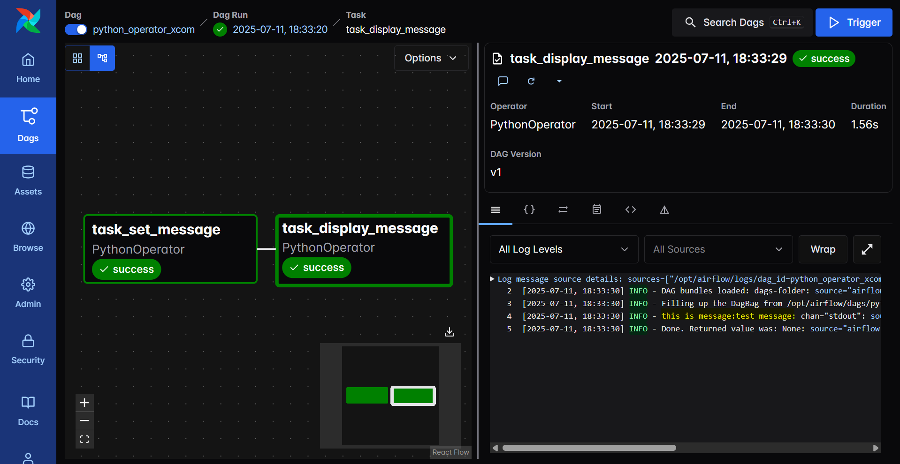
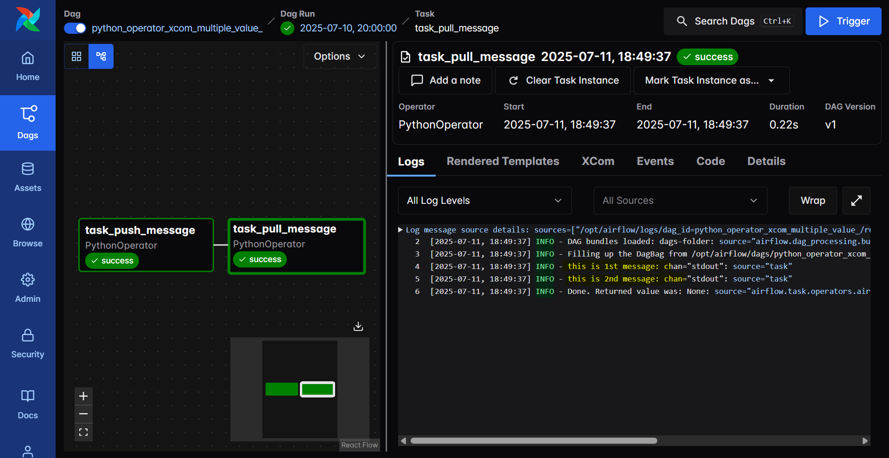

# Airflow - XComs

[Back](../../README.md)

- [Airflow - XComs](#airflow---xcoms)
  - [XComs](#xcoms)
    - [Pass Single Value](#pass-single-value)
    - [Pass Mutiple Values](#pass-mutiple-values)

## XComs

- `XComs` (`cross-communications`)
  - a mechanism that let Tasks talk to each other, as by default Tasks are entirely isolated and may be running on entirely different machines.
- maximum XCOM size is `48KB`

---

### Pass Single Value

```py
from datetime import datetime, timedelta
from airflow.sdk import DAG, task
from airflow.operators.python import PythonOperator

default_args = {
    'owner': 'data engineer',
    'retries': 5,
    'retry_delay': timedelta(minutes=5),
    'schedule_interval': '@daily',
}


# define py function to be executed

def set_message():
    return "test message"


def display_message(**context):
    msg = context["ti"].xcom_pull(task_ids="task_set_message")
    if msg is not None:
        print(f"this is message:{msg}")
    else:
        print(f"Message is none")


with DAG(
    default_args=default_args,
    dag_id='python_operator_xcom_single_value',
    description='DAG with single value xcom',
    start_date=datetime(2025, 7, 10),
    schedule='@daily',
) as dag:
    task1 = PythonOperator(
        task_id='task_set_message',
        python_callable=set_message,
    )

    # task to get parameter from xcom
    task2 = PythonOperator(
        task_id='task_display_message',
        python_callable=display_message,
    )

    task1 >> task2
```





---

### Pass Mutiple Values

```py
from datetime import datetime, timedelta
from airflow.sdk import DAG, task
from airflow.operators.python import PythonOperator

default_args = {
    'owner': 'data engineer',
    'retries': 5,
    'retry_delay': timedelta(minutes=5),
    'schedule_interval': '@daily',
}


# define py function to be executed

def push_message(ti):
    ti.xcom_push(key="message01", value="this is 1st message")
    ti.xcom_push(key="message02", value="this is 2nd message")


def pull_message(ti):
    msg01 = ti.xcom_pull(task_ids="task_push_message", key="message01")
    msg02 = ti.xcom_pull(task_ids="task_push_message", key="message02")
    print(msg01)
    print(msg02)


with DAG(
    default_args=default_args,
    dag_id='python_operator_xcom_multiple_value_',
    description='DAG of with multiple value xcom',
    start_date=datetime(2025, 7, 10),
    schedule='@daily',
) as dag:
    task1 = PythonOperator(
        task_id='task_push_message',
        python_callable=push_message,
    )

    # task to get parameter from xcom
    task2 = PythonOperator(
        task_id='task_pull_message',
        python_callable=pull_message,
    )

    task1 >> task2
```


